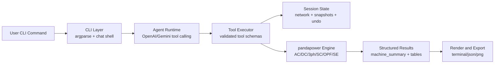

# Architecture

## Runtime principles

- LLM orchestrates, pandapower computes truth.
- Every mutating operation is snapshot-aware for undo/recovery.
- Tools enforce schema-validated args before execution.
- Results are both human-readable and machine-structured.
